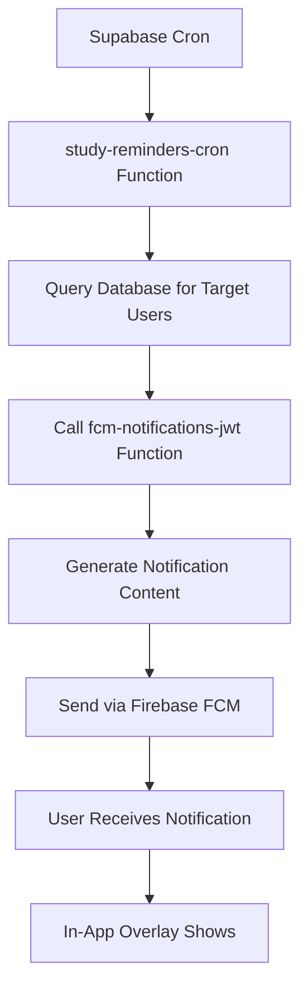

# 🕒 Supabase Cron Setup Guide - Automated Study Reminders

## Overview

This guide shows you how to set up **automated study reminders** for your Athena app using [Supabase Cron](https://supabase.com/blog/supabase-cron), a powerful scheduling system that runs directly in your PostgreSQL database.

## 🎯 Features Implemented

### ✅ **Session Reminders**
- **Frequency**: Every minute (checks for upcoming sessions)
- **Trigger**: 15 minutes before scheduled study sessions
- **Message**: "⏰ [Session Title] starts in 15 minutes"

### ✅ **Daily Check-ins**
- **Frequency**: Daily at 8:00 AM
- **Trigger**: Every morning
- **Message**: "🌅 Good Morning! You have X sessions planned today"

### ✅ **Evening Summaries**
- **Frequency**: Daily at 7:00 PM  
- **Trigger**: End of study day
- **Message**: "🌆 Great Work! You completed X sessions today"

### ✅ **Overdue Goal Alerts**
- **Frequency**: Tuesday and Friday at 10:00 AM
- **Trigger**: Goals past their target date
- **Message**: "⚠️ Don't give up on [Goal Name]! Let's get back on track"

### ✅ **Study Streak Maintenance**
- **Frequency**: Sunday at 6:00 PM
- **Trigger**: Weekly motivation
- **Message**: "🔥 You're on a X-day study streak! Keep it going!"

## 🚀 Setup Instructions

### Step 1: Deploy the Cron Function

First, make sure your study-reminders-cron function is deployed:

```bash
# Deploy the function
supabase functions deploy study-reminders-cron

# Verify deployment
supabase functions list
```

### Step 2: Enable Supabase Cron

1. Go to your **Supabase Dashboard**
2. Navigate to **Project Settings → Integrations**
3. Find **Cron** in the list
4. Click **Enable** to activate the Postgres Module

### Step 3: Create Cron Jobs

#### 🔔 **Session Reminders (Every Minute)**

**Via Dashboard:**
1. Go to **Database → Cron** in your Supabase dashboard
2. Click **Create a new job**
3. Choose **Supabase Edge Function**
4. **Function Name**: `study-reminders-cron`
5. **Schedule**: `* * * * *` (every minute)
6. **Payload**:
```json
{
  "type": "session_reminder"
}
```

**Via SQL:**
```sql
SELECT cron.schedule(
  'session-reminders',
  '* * * * *',
  $$
  SELECT net.http_post(
    url := 'https://YOUR_PROJECT_REF.supabase.co/functions/v1/study-reminders-cron',
    headers := '{"Content-Type": "application/json", "Authorization": "Bearer YOUR_ANON_KEY"}'::jsonb,
    body := '{"type": "session_reminder"}'::jsonb
  );
  $$
);
```

#### 🌅 **Daily Check-ins (8:00 AM Daily)**

**Schedule**: `0 8 * * *`
**Payload**:
```json
{
  "type": "daily_checkin"
}
```

**SQL:**
```sql
SELECT cron.schedule(
  'daily-checkin',
  '0 8 * * *',
  $$
  SELECT net.http_post(
    url := 'https://YOUR_PROJECT_REF.supabase.co/functions/v1/study-reminders-cron',
    headers := '{"Content-Type": "application/json", "Authorization": "Bearer YOUR_ANON_KEY"}'::jsonb,
    body := '{"type": "daily_checkin"}'::jsonb
  );
  $$
);
```

#### 🌆 **Evening Summary (7:00 PM Daily)**

**Schedule**: `0 19 * * *`
**Payload**:
```json
{
  "type": "evening_summary"
}
```

#### ⚠️ **Overdue Goals (Tuesday & Friday 10:00 AM)**

**Schedule**: `0 10 * * 2,5`
**Payload**:
```json
{
  "type": "overdue_goals"
}
```

#### 🔥 **Streak Maintenance (Sunday 6:00 PM)**

**Schedule**: `0 18 * * 0`
**Payload**:
```json
{
  "type": "streak_maintenance"
}
```

## 📋 Complete SQL Setup Script

Run this script to create all cron jobs at once:

```sql
-- Session reminders (every minute)
SELECT cron.schedule(
  'athena-session-reminders',
  '* * * * *',
  $$
  SELECT net.http_post(
    url := 'https://YOUR_PROJECT_REF.supabase.co/functions/v1/study-reminders-cron',
    headers := '{"Content-Type": "application/json", "Authorization": "Bearer YOUR_ANON_KEY"}'::jsonb,
    body := '{"type": "session_reminder"}'::jsonb
  );
  $$
);

-- Daily check-ins (8:00 AM)
SELECT cron.schedule(
  'athena-daily-checkin',
  '0 8 * * *',
  $$
  SELECT net.http_post(
    url := 'https://YOUR_PROJECT_REF.supabase.co/functions/v1/study-reminders-cron',
    headers := '{"Content-Type": "application/json", "Authorization": "Bearer YOUR_ANON_KEY"}'::jsonb,
    body := '{"type": "daily_checkin"}'::jsonb
  );
  $$
);

-- Evening summaries (7:00 PM)
SELECT cron.schedule(
  'athena-evening-summary',
  '0 19 * * *',
  $$
  SELECT net.http_post(
    url := 'https://YOUR_PROJECT_REF.supabase.co/functions/v1/study-reminders-cron',
    headers := '{"Content-Type": "application/json", "Authorization": "Bearer YOUR_ANON_KEY"}'::jsonb,
    body := '{"type": "evening_summary"}'::jsonb
  );
  $$
);

-- Overdue goal alerts (Tuesday & Friday 10:00 AM)
SELECT cron.schedule(
  'athena-overdue-goals',
  '0 10 * * 2,5',
  $$
  SELECT net.http_post(
    url := 'https://YOUR_PROJECT_REF.supabase.co/functions/v1/study-reminders-cron',
    headers := '{"Content-Type": "application/json", "Authorization": "Bearer YOUR_ANON_KEY"}'::jsonb,
    body := '{"type": "overdue_goals"}'::jsonb
  );
  $$
);

-- Streak maintenance (Sunday 6:00 PM)
SELECT cron.schedule(
  'athena-streak-maintenance',
  '0 18 * * 0',
  $$
  SELECT net.http_post(
    url := 'https://YOUR_PROJECT_REF.supabase.co/functions/v1/study-reminders-cron',
    headers := '{"Content-Type": "application/json", "Authorization": "Bearer YOUR_ANON_KEY"}'::jsonb,
    body := '{"type": "streak_maintenance"}'::jsonb
  );
  $$
);
```

**⚠️ Important**: Replace `YOUR_PROJECT_REF` and `YOUR_ANON_KEY` with your actual values:
- **Project Ref**: Found in Project Settings → API → Project URL
- **Anon Key**: Found in Project Settings → API → Project API keys

## 🔍 Monitoring & Debugging

### View Active Cron Jobs
```sql
SELECT * FROM cron.job;
```

### View Cron Job History
```sql
SELECT * FROM cron.job_run_details 
ORDER BY start_time DESC 
LIMIT 10;
```

### View Job Logs
1. Go to **Database → Cron** in dashboard
2. Click on any job to see execution history
3. Check **Logs Explorer** for detailed function logs

### Delete a Cron Job
```sql
SELECT cron.unschedule('job-name');
```

## 🎯 Testing Your Setup

### Manual Test
You can manually trigger any reminder type:

```bash
curl -X POST 'https://YOUR_PROJECT_REF.supabase.co/functions/v1/study-reminders-cron' \
  -H 'Authorization: Bearer YOUR_ANON_KEY' \
  -H 'Content-Type: application/json' \
  -d '{"type": "daily_checkin"}'
```

### Check FCM Tokens
Make sure users have FCM tokens registered:

```sql
SELECT id, fcm_token IS NOT NULL as has_token 
FROM profiles 
WHERE fcm_token IS NOT NULL;
```

## 📊 Expected Notification Flow



## 💡 Customization Tips

### Adjust Timing
- **Session reminders**: Change `15 minutes` to your preference
- **Daily check-ins**: Move to different time (currently 8 AM)
- **Evening summaries**: Adjust for your users' typical study end time

### Add New Reminder Types
1. Add new case in `handleXXX()` function
2. Update notification content in `fcm-notifications-jwt`
3. Create new cron job with custom schedule

### User Preferences
Consider adding a `notification_preferences` table to let users:
- Disable specific reminder types
- Customize timing for personal schedules
- Set quiet hours

## 🚀 Production Checklist

- ✅ Deploy `study-reminders-cron` function
- ✅ Deploy updated `fcm-notifications-jwt` function  
- ✅ Enable Supabase Cron module
- ✅ Create all 5 cron jobs
- ✅ Test each reminder type manually
- ✅ Verify FCM tokens exist for test users
- ✅ Monitor cron job execution logs
- ✅ Set up alerting for failed jobs

## 🎉 Result

Your users will now receive:
- **Smart session reminders** that help them never miss study time
- **Motivational daily check-ins** to start each day with intention
- **Encouraging evening summaries** celebrating their progress
- **Gentle overdue goal nudges** to maintain momentum
- **Weekly streak motivation** to build lasting study habits

This creates a **world-class user experience** that keeps students engaged and motivated! 🌟

---

**Questions?** Check the [Supabase Cron documentation](https://supabase.com/blog/supabase-cron) or run `SELECT cron.job_run_details` to debug any issues. 